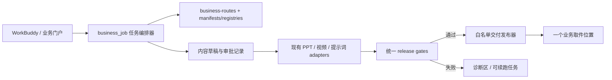

# 项目整体设计评估与业务自助高质量交付提升计划

> 日期：2026-08-08
>
> 范围：产品架构、生产资料库、业务入口、生成链路、审批、质量门禁、交付与仓库治理
>
> 本轮性质：证据化审计与实施路线图；不包含生产链路重构
>
> 锁定方向：金样整片优先、一个项目一个 `style_pack_id`、业务在 WorkBuddy 本机完成正常 settled 任务

## 1. 结论先行

项目已经具备较强的**金样生产与设计沉淀能力**，但还没有完成从“制作体系”到“业务可稳定自助使用的产品体系”的转换。

当前最重要的工作不是继续增加模板、素材或模式，而是把已有 7 个 settled 模板收口成一条可复现、可审批、可质检、成功后才发布的统一生产链路。

建议将当前阶段定义为：

- 金样制作能力：已进入准生产阶段；
- 新 component + recipe 课件架构：方向正确，处于已签样但尚未产品化接入阶段；
- 业务自助：受控试点，不应统一标记为“可换主题量产”；
- 视频正式交付：当前机器不具备完整能力，环境探测结果为 `video_full=false`；
- 整体状态：**生产能力强，产品化、可复现性和发布治理偏弱。**

| 维度 | 当前成熟度 | 判断 |
|---|---|---|
| 金样与视觉复刻 | 强 | 有清晰方法、7 个 settled 模板、预览与业务 Word |
| 内容驱动与可编辑交付 | 中强 | 新课件引擎方向好，已有签样和文本溯源能力 |
| 资料库与事实源治理 | 中弱 | manifest、registry、catalog、脚本硬编码存在漂移 |
| 业务入口与任务闭环 | 弱 | 当前门户是模板导航页，不是任务编排器 |
| 清洁安装与运行复现 | 弱 | bootstrap 不负责依赖闭环；本机能力不能代表业务机器 |
| 审批与质量发布协议 | 中弱 | 规则丰富，但关键闸门未全部变成代码硬约束 |
| 交付卫生与可追溯性 | 弱 | 失败任务可进入交付目录，业务输入还存在误提交风险 |

## 2. 值得保留和放大的设计

### 2.1 金样优先是正确的主轴

项目规则、模板复刻 Skill、brief 和 lessons 已经形成一致方向：先完成整套金样，再锁框架与 style pack，随后在同一框架内换主题。这比先堆素材更能保障最终成片质量，应继续作为所有架构选择的上位约束。

### 2.2 新 component + recipe + page type 架构值得成为 PPT 主路径

当前新架构已经把风格、构件、布局规则、页型 recipe、内容脚本和文本溯源拆开，并经过金样回归与候选页型签样。它解决的是“内容变化时仍能保持金样设计语言”，比按页硬编码或堆大量整页模板更有扩展性。

应保留这套设计，但先完成三件事：纳入正式版本控制、接入统一业务入口、建立金样回归与发布闸门。不要再平行发展第三套课件生成路径。

### 2.3 业务允许只给部分材料，方向正确

“产品名也可以开始 → 系统先给内容草稿和缺口 → 业务确认后生成”的合同，能显著降低业务使用门槛。它应成为统一任务状态机，而不只是文档约定。

### 2.4 授权、包装和正式音色规则成熟

不伪造品牌包装、业务提供证据和授权图、正式旁白必须写 `voice_id`、不以系统 TTS 冒充正式成片，这些都是高质量和合规交付的关键底线。后续需要把它们升级为 release gate 的硬检查。

## 3. 关键问题与根因

### P0：会导致业务不能用、走错路、错误交付或数据风险

| 问题 | 证据 | 业务影响 | 根因 |
|---|---|---|---|
| 一句话安装没有闭环运行环境 | `workbuddy_bootstrap_for_business.py` 主要做 clone/pull、同步和开门户；依赖目录被忽略；根目录无完整锁定依赖 | 清洁机器可能只能看模板，不能生成 | 把现有开发机能力误当成可分发产品能力 |
| 环境探测会产生“整体 OK”的错觉 | 本轮 `probe_production_env.py --json` 返回顶层 `ok=true`，但 `video_tts=false`、`video_full=false` | 业务以为可出正式视频，最后才失败 | 顶层状态未按所选任务的必需能力判断 |
| 门户视频口令也写成“生成 ppt” | `business_guided_portal.py` 的 `buildCmd()` 对所有模板使用同一句 PPT 口令 | 视频模板直接错路由 | 展示、口令与生成器没有统一 route registry |
| `production_ready=true` 不等于可自助换主题 | 7 个模板全部标 ready；课件 4 CLI 明确返回“换主题尚未接线”；视频又依赖本机能力 | 业务无法判断真实可用范围 | 一个布尔字段混合了金样、流程、机器能力和正式交付能力 |
| 健康视频文档命令与实现互相冲突 | 文档默认 full 命令不带 `--theme-package`；正式 renderer 会拒绝未审批主题包 | 标准业务路径必然失败 | 文档、流程前置条件和运行时代码来自不同事实源 |
| 健康视频会派生审核稿之外的医学屏显 | renderer 会按病名推断“风邪/热邪/入侵身体”、默认治则，并在内容不足时补写辨证说明 | 可能把 AI 派生结论写进正式培训材料 | 内容映射与医学创作没有代码边界，缺逐句 provenance 硬门 |
| 无授权商品图时正式视频回退到通用 Q10 包装 | product full 在没有 `product_image` 时使用 `generic-coq10-packshot-v1.png`；registry 只允许该类占位用于预览 | 主题、包装和授权关系错误，可能形成错误正式成片 | 草稿占位与正式发布使用同一 fallback |
| 审批没有成为所有生成器的硬闸门 | 部分流程要求先确认；系统提示又允许说“生成”后直接输出；部分 scaffold 同次产出复核稿和终稿 | 可能绕过内容、视觉或费用确认 | 审批仍是自然语言约定，而不是任务状态 |
| Prompt-only 模式未真正执行“先审后终稿” | Seedance 与两类九宫格 scaffold 一次运行同时写复核包、终稿提示词和发布包 | 未经业务确认的内容看起来已经可发布 | `draft` 与 `release` 没有分成两个命令和状态 |
| 失败任务可被复制进正式交付目录 | `generate_business_video.py` 在计算最终 `summary.ok` 前执行 `copytree(out_dir)` | 业务可能拿到失败包、源码、日志和巨量临时文件 | “运行目录”和“发布目录”没有发布者边界 |
| 已有失败包证明该风险真实存在 | `05_交付物放这里/ganmao-cold-v1-2groups` 约 1.4 GB、1.4 万文件，无最终成片且含 render workspace/堆栈 | 业务误判结果，存储和排障成本高 | 交付按目录复制，而不是成功后按白名单发布 |
| 业务输入存在误提交到公开仓库的风险 | 上传说明允许把 Word/授权图放进仓库；`.gitignore` 又重新纳入整个业务包 | 可能泄露未公开产品资料和授权素材 | 业务数据目录与代码仓库没有隔离 |
| 业务包不可重复构建 | 打包器先删除整个业务包，只重建基础目录，未覆盖 08–11 新模式 | refresh 会丢内容，zip 与当前系统不一致 | 主包、旁挂模式和文档不是同一生成源 |
| Public 仓库的素材与声纹分发权需要专项复核 | README 限定内部授权用途，但仓库中存在大金样、克隆声参考与正式音频，根级未见统一 LICENSE/NOTICE/声纹授权凭证 | 内部可用不自动等于可通过 Public Git 再分发 | 使用授权、仓库公开分发授权和运行时下载机制尚未分层 |

### P1：明显增加维护成本、质量波动和业务返工

1. manifest、registry、catalog、同步脚本和文档复制同一事实，已有 canonical、style 引用和 Word 来源漂移。
2. 生产入口仍有大量模板、voice、style、路径硬编码，资料库主要用于记录，尚未成为运行时控制面。
3. 新 component/recipe 引擎与旧模板专用生成器并存，且部分关键文件仍未跟踪；清洁克隆无法获得刚签样的新能力。
4. 正式 generator 仍可能依赖 `poc/`、`validation/` 或 settled 内脚本，生产代码与验证产物边界不稳定。
5. PPT、产品视频、健康视频、数字人、Seedance、九宫格等按内部实现术语并列，业务需要理解技术路线后才会选。
6. 产物分散到多个目录，没有统一“待确认、处理中、质检失败、已交付”的任务面。
7. 当前测试能证明部分内容导入规则未坏，但项目无 CI、无 clean-clone E2E、无 registry/manifest 一致性测试。
8. Git 同时承载代码、金样、业务包和大成品；tracked 工作树约 600+ MB，安装和同步成本偏高。

## 4. 门户与业务体验走查

### 已有优点

- 首屏使用“选模板 → 看关键页 → 复制口令”的三步结构，学习成本低；
- 模板预览来自真实 settled 金样，不是假想占位；
- 绿色商品课件详情中已经展示内容结构和填写参考；
- 对包装、Logo、证据材料的责任边界表达较诚实。

### 主要体验问题

- 业务先看到 7 个模板和多个旁挂模式，而不是先回答“给谁看、要什么成品”；
- 点击“选用”只是复制文本，还要回到 WorkBuddy 再粘贴，任务状态没有被真正创建；
- 模板卡使用可点击 `<article>`，没有键盘角色与焦点语义；
- 390 px 宽度仍显示两列小卡，页面文案仍说“一行 4 个”，移动端阅读与说明不一致；
- 选择后没有“草稿待确认 / 正在生成 / 已交付”任务状态和统一取件位置。

界面审计证据保存在：

`production-library/validation/audits/project-design-2026-08-08/`

本轮完成桌面、模板选择、复制反馈和 390 px 移动视口走查；未进行完整屏幕阅读器、键盘全流程和 WCAG 对比度认证，因此不对完整无障碍合规做结论。

## 5. 目标业务体验：五步完成一单

业务最终只需要理解这一条主流程：

```text
选我要做什么 → 交已有内容 → 审初稿 → 自动生成与质检 → 一个地方取件
```

### 5.1 先按业务目标分流，不按引擎名分流

第一问只问受众：

- 店员内部培训；
- 大众短视频 / 视频号。

第二问只问交付物：

- 可编辑 PPT；
- 本机完整 MP4；
- 外部平台提示词包。

第三步才选择风格或金样：

- 内部培训 PPT：按内容推荐 2–3 个 settled 金样；
- 内部培训 MP4：区分商品培训与疾病培训；
- 数字人是 PPT/视频确认后的付费增强，不是顶层产品；
- 大众短视频默认严格无医疗，再选择五拍或九宫格；林医生原版为明确的非默认分支。

### 5.2 一个统一任务状态机

```text
intake
  → draft_ready
  → content_approved
  → visual_approved（按需）
  → rendering
  → qa_passed
  → delivered
```

失败状态不进入交付目录，而是进入 `needs_input`、`env_blocked` 或 `qa_failed`，并明确告诉业务：已经保留什么、系统下一步做什么、业务是否需要动作。

普通任务只向业务展示六种中文状态：

```text
可开始草稿 / 等待业务资料 / 等待内容确认 /
等待视觉确认 / 正在生成 / 质检失败或已交付
```

## 6. 目标系统：在现有生成器上增加一个薄控制面

不建议推翻现有金样生成器。更简单的方案是在它们之上增加一个任务编排与发布控制层：



最小新增边界：

1. `business-routes.json`：中文名称、受众、成品类型、模板、所需环境、审批闸门、adapter、QA profile、交付白名单。
2. `business_job.py`：`new / draft / approve / render / status / open`；业务不再拼内部命令。
3. 任务目录：放在 Git 忽略的本地 workspace；记录稿件 hash、批准人、批准时间、模板/style/voice/engine 版本。
4. release gates：统一决定是否允许进入正式交付。
5. delivery publisher：只在 `qa_passed` 后复制少量白名单文件，绝不复制 workspace、源码、依赖和原始堆栈。

### 6.1 用能力矩阵替换单一 `production_ready`

每个模板至少拆成：

| 字段 | 含义 |
|---|---|
| `gold_viewable` | 有已确认金样和预览 |
| `new_theme_draft` | 可生成换主题内容初稿 |
| `new_theme_preview` | 可生成业务确认用预览 |
| `new_theme_pptx` | 可正式导出可编辑 PPTX |
| `new_theme_mp4` | 可正式导出完整 MP4 |
| `business_selfserve` | 当前机器、当前版本可由业务独立完成 |
| `requires_external_account` | 需要 HeyGen/Seedance 等外部付费能力 |

门户显示的是“本模板能力 × 当前机器能力”的交集，而不是静态宣传状态。

## 7. 统一高质量交付协议

正式交付采用**硬闸门 + 质量报告**，不能用平均分掩盖合规或技术失败。

### G0 内容与审批

- 内容来源可追溯；
- 每句旁白、字幕和医学屏显均能映射到审核稿 source span；无法映射只报缺口，不自动补结论；
- 正式稿 hash 与批准记录一致；
- 需要视觉、关键页或费用确认的任务均已批准；
- pending 状态不得输出正式交付。

### G1 素材与合规

- 包装、Logo、证据和授权图来源明确；
- 无假包装、无占位素材、无模式红线命中；无授权包装只能存在于显式草稿，不能 release；
- 人声参考需有 consent、用途、期限和分发范围记录；
- 每项目只有一个 `style_pack_id`。

### G2 模板与视觉一致性

- 页面/分段结构符合 settled 框架；
- 关键页与金样回归无不可接受偏移；
- 无溢出、遮挡、错误主题残留、空行凑数和静默 fallback。

### G3 技术完整性

- PPTX 可打开、页数和原生可编辑性符合合同；
- MP4 可完整解码、音画时长一致、无异常黑帧/静帧；
- 正式旁白 `voice_id` 正确，ASR 专名检查通过，音量、爆音、截断和静音检查通过；
- 建议初始音频门槛：综合响度 `-16±1 LUFS`、True Peak 不高于 `-1.5 dBFS`，再用真实任务校准。

### G4 可追溯与发布卫生

- 生成统一 `run-manifest.json`，记录模板、style、voice、内容 hash、engine、环境、QA 和成品 hash；
- 失败只生成诊断包，不产生正式交付状态；
- 业务可见文件建议不超过 8 个。

建议每单业务默认只看到：

- `终稿.pptx` 或 `终稿.mp4`；
- `预览.pdf` 或 `关键帧预览.pdf`；
- `交付说明.md`；
- `内容确认记录.pdf`；
- 必要时一份 `仍需补充.md`。

内部 manifest、日志、QA JSON、workspace 统一隐藏到任务内部目录。

## 8. 分阶段提升计划

以下按退出条件推进，不按“做了多少文件”判断完成。

### P0：让系统先说真话并停止错误发布

目标：消除错路由、误报可用、失败交付和业务数据泄露风险。

任务：

1. 修复门户视频口令，按真实产物生成命令；
2. 把 readiness 改为能力矩阵，暂时关闭未接线或本机不可用的正式生成入口；
3. 修正健康视频主题包前置流程和文档；
4. 删除健康视频所有审核稿之外的医学推断与默认补写；无法溯源时只写缺口；
5. 商品正式视频缺授权包装时硬阻断；占位包装只允许草稿预览；
6. 把 Prompt scaffold 拆成 `draft` 与带批准记录的 `release` 两阶段；
7. 把内容/视觉/数字人费用确认变成绑定对象 hash 的硬闸门；
8. 只有最终 `qa_passed` 才发布，交付采用文件白名单；
9. 把业务上传、运行 workspace 和交付目录移出 Git 跟踪范围；
10. 复核 Public 仓库中包装、Logo、金样、人声和音频的分发权，未确认资产改为受控按需包；
11. 修复 bootstrap 拉取失败仍继续、probe 顶层误报和业务包不可重复构建；
12. 建立 manifest/registry/catalog/canonical/引用一致性校验。

退出条件：

- 门户、文档、runner 的 active route 数和能力状态 100% 一致；
- broken reference、canonical mismatch、stale Word source 均为 0；
- pending approval 正式交付数为 0；
- 未溯源医学屏显/旁白为 0，无授权包装 release 数为 0；
- Prompt 模式未批准时只产生复核包；
- 失败任务进入交付目录数为 0；
- 业务输入和正式交付出现在 `git status` 的数量为 0；
- 业务包连续构建两次结构一致。

### P1：建立一个统一业务任务控制面

目标：让业务不再理解脚本、mode ID、TTS、JSON 或目录路径。

任务：

1. 建立唯一 `business-routes`；
2. 实现 `business_job` 状态机与 adapter 接口；
3. 接入至少一条核心 PPT 路线和一条核心视频路线；
4. 记录稿件、素材和视觉批准；支持 status、resume、retry；
5. 门户从“复制口令”升级为创建/继续任务的入口；
6. 统一“待我确认、处理中、质检失败、已交付”和一个取件位置；
7. 由 routes 自动生成门户数据、WorkBuddy 提示和业务说明，减少多处手写漂移。

退出条件：

- 正常业务路径中技术命令数量为 0；
- 5 名非技术业务测试首次选对路线比例 ≥95%；
- 无工程师介入完成率 ≥80%；
- 视频分段失败后已成功段复用率 100%；
- 每个 settled 模板都能准确显示“能做什么、缺什么、下一步是什么”。

### P2：可复现运行环境与生产引擎收敛

目标：清洁机器获得与开发机一致、诚实可验证的生产能力。

任务：

1. 提供 PPT/video/optional-external profiles 和锁定依赖；
2. bootstrap 完成平台识别、安装/修复、按 route 的 `doctor --require`；
3. 将已签样 component/recipe/page type 引擎纳入正式版本控制和 WorkBuddy 主路径；
4. 老 PPT 模板通过 adapter 接入，金样回归后再退役旧入口；
5. 抽取视频共享 runtime：TTS、切段、素材解析、渲染、合成、字幕、QA；
6. 正式生产代码不再依赖 `poc/` 和 `validation/`；
7. 大金样、模型和成品改为按需版本包/Release/LFS，不再全部随主仓库同步。

退出条件：

- 支持平台 clean clone 后 PPT 首次自助成功率 ≥95%；
- 视频环境自动准备成功率 ≥90%；
- 至少一条 PPT、产品视频、健康视频 route 通过干净机器 E2E；
- 正式 production path 对 `poc/`、`validation/` 的代码依赖为 0；
- 每类能力只有一个正式业务入口；
- 每个模板族用 2 个新主题完成泛化验收。

### P3：质量闸门、CI 与度量闭环

目标：把金样质量要求变成所有业务任务不可绕过的发布协议。

任务：

1. 实现 G0–G4 统一 release gates 与 `run-manifest`；
2. 把现有金样的 ffprobe、完整解码、黑场、响度和哈希检查抽为共用 runner；
3. 将文本 provenance 扩展到视频旁白、字幕和屏显；
4. 每次提交执行 schema、引用一致性、单元测试和轻量渲染；
5. 定时或发布前执行完整金样回归、PPT 预览比较和音视频 QA；
6. 按匿名任务阶段记录路由错误、失败类型、返修轮次和耗时；
7. 依据真实使用数据再决定是否增加新模板或模式。

退出条件：

- 100% 正式交付具有 approval、provenance、QA 和成品 hash；
- 最终 PPTX 可打开、MP4 可完整解码的通过率 100%；
- settled 工作流首次 QA 通过率 ≥95%；
- 首稿内容通过率 ≥85%，平均返修轮次 ≤1.5；
- 所有失败均可归因到内容、素材、环境、渲染或 QA 阶段；
- 不存在静默 fallback。

### 建议节奏

- 0–30 天：完成 P0 止血和最小 CI，先证明系统会诚实阻断；
- 31–60 天：完成 P1 控制面，并把现有金样 QA 接入两条核心路线；
- 61–90 天：完成 P2/P3 的干净机器试运行、质量 SLO 和 12–20 个真实业务任务验证。

具体日历取决于投入人力，但任何阶段都应以前述退出条件为准，不能因时间到期跳过硬门。

## 9. 实施优先级与取舍

### 先做

1. 唯一事实源 + readiness 真值；
2. 审批硬闸门 + 成功后白名单发布；
3. 业务数据 Git 隔离；
4. 一个 job runner；
5. clean-clone 可复现环境；
6. 统一 release gates。

### 暂缓

- 新增第 8 个 settled 模板；
- 继续扩充通用素材库存；
- 再增加新的大众视频模式；
- 在任务闭环之前重做大而全的门户；
- 一次性重写所有旧生成器。

### 推荐首批产品化范围

优先打通两条高频、边界清晰的金样路线：

1. **内部商品培训 PPT**：以新 component/recipe 引擎为主路径；
2. **内部商品培训完整 MP4**：复用现有产品视频金样，补齐环境、审批、QA 和发布。

健康疾病视频在主题包流程、正式音色与干净环境验证完成后再开放为业务自助。课件 4 等未接线能力先诚实标记为“仅金样预览”，不删除金样，也不虚标可量产。

## 10. 本轮验证记录与限制

本轮已完成：

- 查询锁定决策 `decision.gold-sample-first`；
- 走查 WorkBuddy bootstrap、业务门户、模板选择与复制反馈；
- 桌面和 390 px 移动视口截图审计；
- 检查 settled catalog、manifest/registry、生成入口、交付和业务包构建逻辑；
- 执行 `python3 scripts/test_content_driven_rules.py`，通过；
- 执行 `python3 scripts/test_plan_training_course.py`，6 项通过；
- 执行 `python3 scripts/probe_production_env.py --json`，PPT 能力可用，但 `video_tts=false`、`video_full=false`。

限制：

- 没有在一台全新业务电脑上执行 clone/install/render，因此 clean-clone 成功率是待建立的验收目标，不是当前已证明指标；
- 没有调用外部付费数字人或视频 API；
- 没有重新渲染全部 7 个 settled 模板；
- 未做完整无障碍认证；
- 工作树已有大量用户进行中的修改和未跟踪的新架构文件，本轮没有整理或覆盖这些变更。

## 11. 建议的下一实施批次

先实施 **P0“真值与安全收口”批次**，范围固定为：

1. readiness 能力矩阵与一致性校验；
2. 门户/健康视频/审批合同修正；
3. 医学内容零派生、无授权包装阻断、Prompt 两阶段；
4. 成功后白名单发布；
5. 业务输入、运行区和交付区 Git 隔离及 Public 资产权利复核；
6. bootstrap/probe/业务包构建的诚实失败与可重复验证。

该批次不重写生成器、不加新模板、不扩素材库；通过退出条件后，再进入统一 `business_job` 控制面。

---

## 12. 实施进度更新（2026-08-09）

> 详细交接：`docs/session-handover-2026-08-09.md` · 清单：`tasks/todo.md` 顶部

| 规划项 | 状态 | 备注 |
|--------|------|------|
| P0 真值与安全 | **完成** | 已合 Private main |
| P1 统一 business_job | **完成** | new/draft/approve/render |
| P2 可复现环境 + 引擎收敛 | **完成** | profiles/doctor/engines/clean-clone |
| 内部商品培训 PPT 主路径 | **完成** | `product-pptx-component-v1` 默认；绿色五页已下线 |
| 内部商品培训完整 MP4 | **路线开放** | 环境用 `video_full_env.py`；业务现场验另排 |
| 健康疾病视频业务自助 | **未开放** | 专项 B，明日后续 |
| P3 G0–G4 CI / 度量 | **未开** | 规划仍有效，未实施 |

**当前 active 业务路线：** 构件 PPT + 商品 full MP4。  
**用户已排期未开工：** ① 业务验 PPT ② 健康视频自助。
